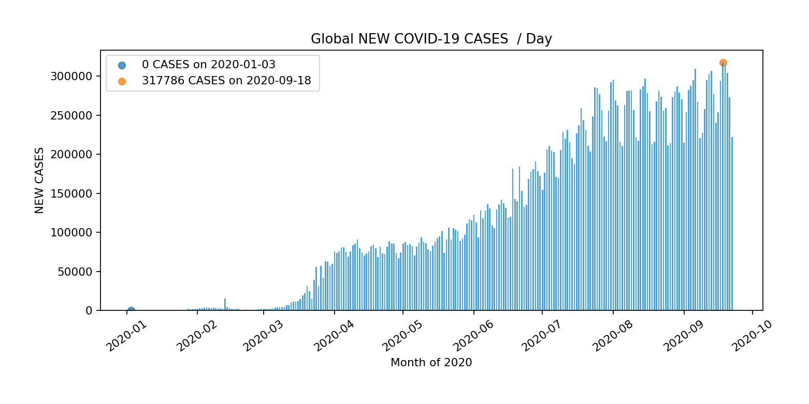
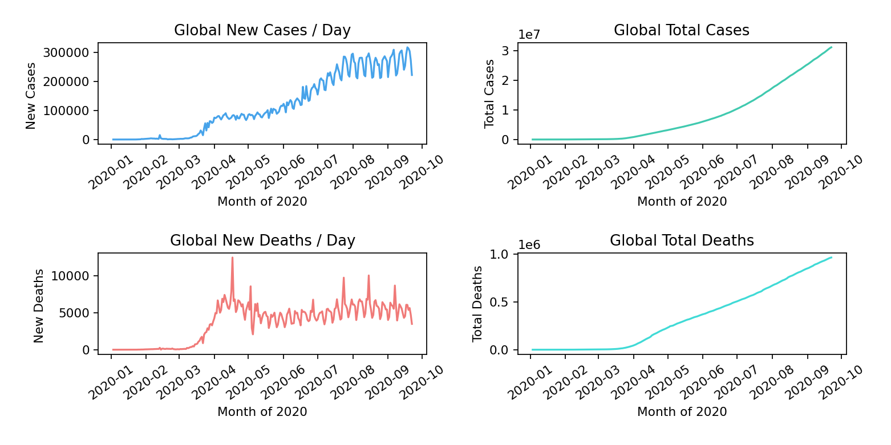
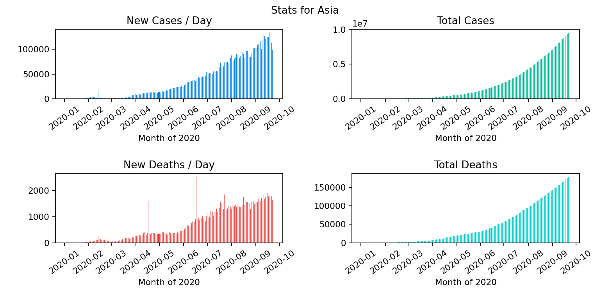
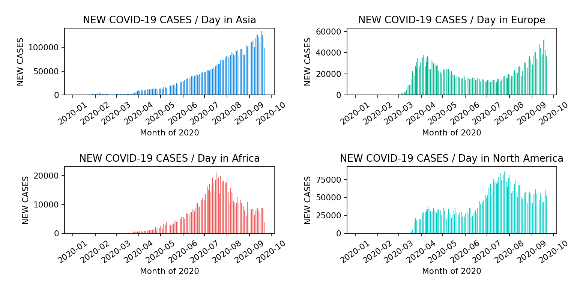
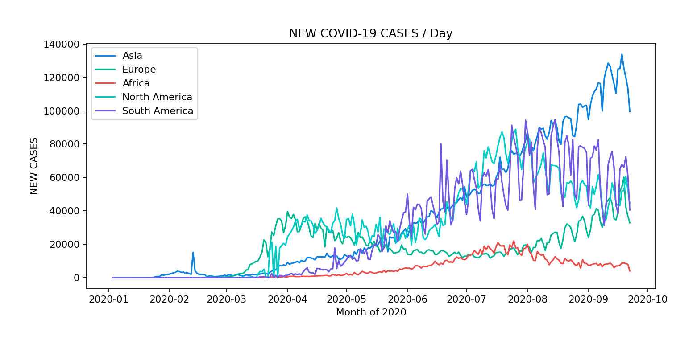
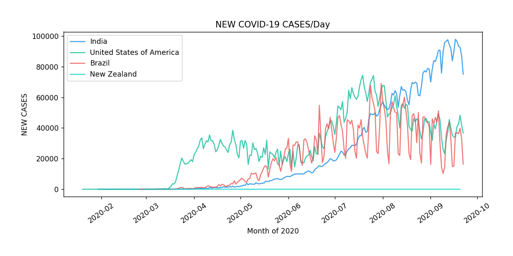
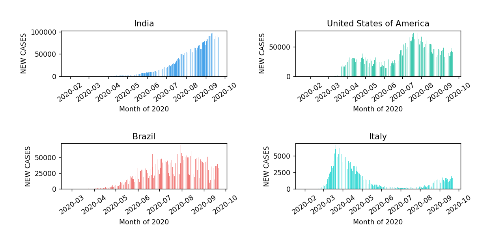
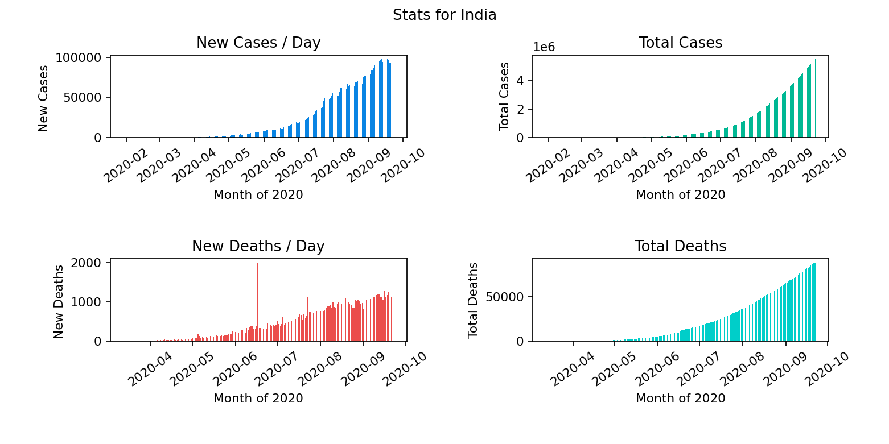
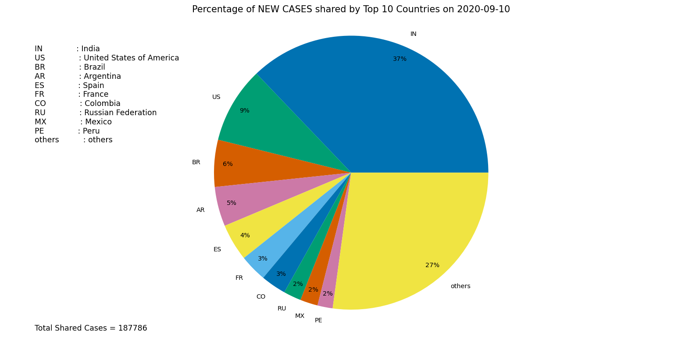
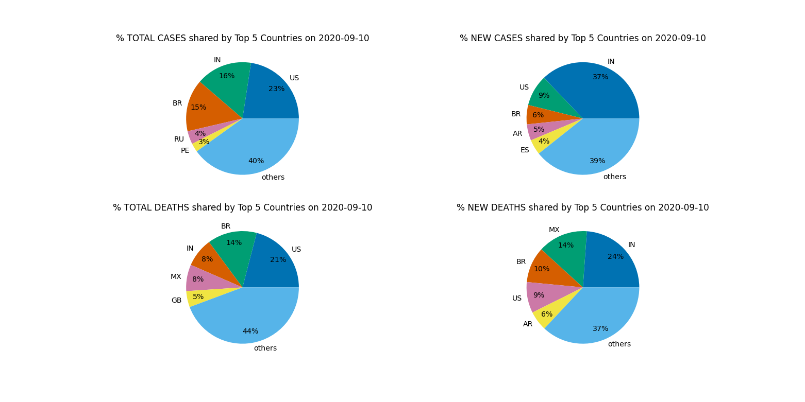

Data donwloaded from https://covid19.who.int/table

Hosted on - https://covid19-data-viz.herokuapp.com/

# Global Data

### 1. Bar graph for certain data

### 2. Bar graph for all data

### 3. Line plot for all data

# Continent Data

### 1. Bar graph for all data of a continent
*Can also plot a line plot*

### 2. Certain data for many continents bar

### 3. Certain data for many continents line plot

# Country Data

### 1. Certain data for many countries line plot

### 2. Certain data for many countries bar plot

### 3. All Data for a country
*line plot also available*

# Pie Chart

### 1. Percentage of global cases shared by top 10 countries

### 2. Percentage of all cases shared by top 5 countries

